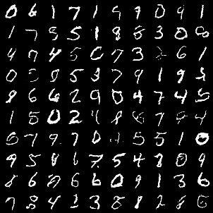

# Flow Matching
This repo contains simple reimplementation of Flow Matching paper: [Lipman, Yaron, et al](https://arxiv.org/abs/2210.02747)

## Data
To train our model we used [MNIST dataset](https://yann.lecun.com/exdb/mnist/).

## Setup
#### Pip
`pip install -r requirements.txt`

## Training
`python src/train.py`

There is a couple of settings you may want to specify:
- `--batch_size` - set depending on your gpu memory available
- `--num_epochs` - num epoch to train the model
- `--lr` - learning rate
- `--device` - which device to use
- `--output_path` - path to save training artefacts

## Inference
`python src/inference.py`

There is a couple of settings you may want to specify:
- `--checkpoint_filepath` - path to pretrained model
- `--num_samples` - how many samples to generate
- `--device` - which device to use
- `--output_path` - filepath to save result image

## Results

<em>Generated samples</em>

## References
<a id="1">[1]</a>
[Flow Matching for Generative Modeling.](https://arxiv.org/abs/2210.02747)

<a id="2">[2]</a>
[TorchCFM: a Conditional Flow Matching library.](https://github.com/atong01/conditional-flow-matching/tree/main)
